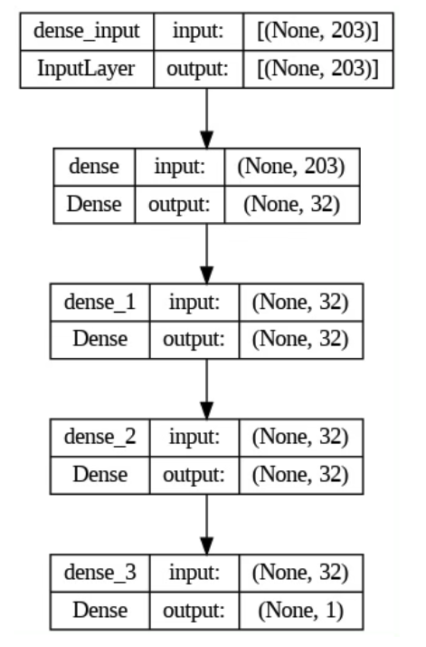

## Overview
This is the project repository for CSE151A at UCSD in WI24. It encompasses a comprehensive analysis and the development of predictive models focused on crop yield data in India. Inside, you will find datasets, analytical scripts, model training algorithms, and results that aim to enhance our understanding and forecasting of agricultural productivity. Detailed documentation is provided to guide you through each component of the project.

Below is the writeup for this project. Here is the link to our <a href="https://github.com/xgui17/CSE151A/blob/main/Model%203%20and%20Final%20Submission.ipynb">jupyter notebook</a>, feel free to check it out!

## 1. Introduction
India stands as the world's largest country by population and seventh largest country by area, a factor that inherently underscores the critical need for sustainable agricultural practices to ensure food security for its billions of inhabitants. The sustainability of people’s daily food source is not just a matter of national concern but has global implications, considering India's significant role in the global food market. As a major producer of various staple crops, including rice, wheat, pulses, any fluctuation in India's agricultural output can have far-reaching effects on global food prices and availability. 

This project is aimed at predicting crop production in India, hoping to leverage machine learning techniques to tackle the challenge of optimizing agricultural output. By analyzing various features such as season, geographical data, and crop variety, the project seeks to explore and forecast crop production. This predictive goal offers the potential to improve how agricultural policy is formulated and how resources are allocated. This project is interesting due to its unique and interdisciplinary structure, which merges the realms of agriculture, environmental science, and technology. It embodies the essence of innovation, applying the latest advancements in data analytics and machine learning to solve real-world problems that could potentially affect millions of lives. Moreover, by predicting crop production, the project provides insights that can help in mitigating the effects of potential food shortages, reducing waste, and enhancing food distribution strategies. By understanding the variables that impact crop production, the project can guide farmers towards more sustainable agricultural practices, reducing the environmental footprint of farming and ensuring the long-term viability of India's agricultural sector.

The dataset used in this project stands out for its completeness, a vital characteristic that ensures a comprehensive overview of the variables influencing crop production in India. A well-constructed description accompanying the dataset offers clear insights into what the data represents. Credibility is another cornerstone of the dataset's selection. The source of the original data is transparently indicated, assuring of its authenticity and reliability. By relying on a dataset whose origins are clear and verifiable, the project establishes a solid foundation that readers can trust. Compatibility is equally critical. The dataset is structured in such a way that there are no ambiguous columns or undefined values, such that each piece of data can be accurately interpreted and utilized in predictive models. The cleanliness and usability of the dataset is also another key component. With minimal null values and a well-maintained structure, the dataset is primed for analysis without the need for extensive cleaning or preprocessing. In summary, the dataset for predicting crop production in India was chosen due to its completeness, credibility, compatibility, and cleanliness. These attributes ensure that the dataset is not only easy to work with but also robust and reliable, providing a strong foundation for generating accurate and meaningful predictions. 

## 2. Figures

  
   
  Source: https://ipad.fas.usda.gov/countrysummary/Default.aspx?id=IN
   
  <em>Figure 1: visual representation of India's crop calendar, showing the planting, growing, and harvesting seasons for various crops, along with their contribution to total agricultural production.</em>

  
   
  Source: https://www.ers.usda.gov/data-products/chart-gallery/gallery/chart-detail/?chartId=78652
   
  <em>Figure 2: compares the agricultural output shares from various sectors in India between two periods: 1980-1984 and 2004-2008, showing a shift in the percentage contribution of grains, horticultural crops, specialty crops, pulses, oilseeds, and livestock to the total agricultural output.</em>

## 3. Methods

### 3.1 Data Exploration
The dataset used in the analysis include information on various crops grown in different states and districts of India and the corresponding yields of these crops in different years. The dataset is obtained from <a href=https://www.kaggle.com/datasets/zsinghrahulk/india-crop-yield/data>kaggle</a>. For ease of access, it is replicated within this repository.

The dataset consists of the following columns:

  1. `State`: Indicates the State of India in which the crop yield is measured.
  2. `District`: Indicate the district of the State in which the crop is grown.
  3. `Crop`: Indicates the specific crop grown in the field. 
  4. `Crop_Year`: The year the crop was harvested or produced. 
  5. `Season`: Divides the cropping period of the crop into different seasons. 
  6. `Area`: Measurement of the area of a crop field. 
  7. `Production`: Indicates the total production of a crop field in a given season. 
  8. `Yield`: Calculates the yield per unit area for that particular observation.

The data exploration consists of several parts:

  - **Observation Count (`shape[0]`)**: Identifies the total number of observations in the dataset.
  - **Column Examination (manual categorization)**: Columns classified into categorical and numerical groups.
  - **Missing Data Analysis (`isna().sum()/shape[0]`)**: Detects missing values in the dataset.
  - **Data Distribution (`describe()`)**: Understands the distribution of numerical variables.
  - **Uniqueness Analysis (`nunique()`)**: Checks the number of unique values in each column.
  - **Value Counts for Categorical Data (`value_counts(normalize=True)[:5]`)**: Provides a deeper understanding of categorical variables.
  - **Outlier Identification**: Identifies outliers in each column.

### 3.2 Preprocessing
- **Addressing Missing Values**: Eliminates rows containing missing values.
- **Addressing Outliers**:

  
   
  <em>Figure 3: shows the relationship between `Area` and `Production` with outlier included.</em>
   
   
  Recognizes the potential influence of outliers, especially in the `Yield` and `Production` columns.

- **Drop Unused Column**: `Yield` column excluded to mitigate multicollinearity risks and enhance interpretability.
- **Log Transformation**: Addresses skewness in the data, improving predictive model performance.
- **One-hot Encoding**: Helps in better learning from categorical columns.
- **Aggregation of Low-frequency Categorical Values**: Simplifies specific columns to prepare the dataset for deeper analysis.

### 3.3 Model 1 - Polynomial Regression
**Polynomial Regression**: Captures complex, nonlinear dynamics in agricultural productions. The model equation is as follows:

$$y = \beta_0 + \beta_{crop}X_{crop} + \beta_{season}X_{season} + \beta_{crop\_year}X_{crop\_year} + \beta_{state}X_{state} + \beta_{season\_crop}X_{season\_crop} + \beta_{cropYear\_season}X_{cropYear\_season} + \varepsilon$$

- **Train Test Split**: Split the dataset into training and testing sets to evaluate the predictive capabilities and ensure generalizability.
- **Baseline Model**: Uses a baseline linear regression to establish a baseline for comparison with more complex models.
- **Feature Extension**: Introduces higher-degree combinations of existing variables to reflect the complexity of agricultural production.
- **MSE Metric**: Facilitates a comprehensive assessment of model accuracy and generalizability.
- **Comparative Analysis**: Between baseline linear regression and polynomial regression with an interactive term to evaluate polynomial model's efficacy.

### 3.4 Model 2 - Random Forest Regressor
**Random Forest Regressor**: Utilizes ensemble learning with multiple decision trees for accurate and robust predictions.

- **Train Test Split**: Split the dataset into training and testing sets to evaluate the predictive capabilities and ensure generalizability.
- **Baseline Model**: Uses a baseline regressor with randomly selected parameters as a reference.
- **Hyperparameter Tuner**: Systematic search over a parameter grid to minimize prediction error.
- **MSE Metric**: Used to capture the predictive accuracy of the model.

  
   
  <em>Figure 4: This is the generic representation of a decision tree in our random forest model, which classifies data through asking questions at each node. The source of the figure is shown in the figure.</em>

### 3.5 Model 3 - Neural Network with Dense Layers
**Neural Network**: Models complex patterns using a sophisticated approach for better predictions.

- **Train Test Split**: Split the dataset into training and testing sets to evaluate the predictive capabilities and ensure generalizability.
- **Baseline Model**: Utilizes three dense layers with sigmoid activation and a final output layer for regression, trained with SGD optimizer to establish a baseline performance for future comparison.
- **Hyperparameter Tuner**: Employs Keras Tuner to find the optimal model configuration.
- **K-fold Cross-Validation**: Evaluates model performance across different dataset segments for a comprehensive view.
- **MSE Metric**: Aligns with previous models to measure predictive accuracy.

  
   
  <em>Figure 5: This is the structure of the neural net work model we will use, which the number of nodes in each layer and the number of layers are specified in the figure.</em>

## 4. Results

### 4.1 Data Exploration
- **Observation Count (`shape[0]`)**: The dataset comprises 345,336 observations.
- **Column Examination**: Five categorical columns (`State`, `District`, `Crop`, `Crop_Year`, `Season`) and three numerical columns (`Area`, `Production`, `Yield`).
- **Missing Data Analysis**: Detected missing values, leading to considerations about retention or removal.
- **Data Distribution**: Analysis allows identification of variable spread and central tendencies.
- **Uniqueness Analysis**: Identified 37 unique states, 707 districts, 55 crops, 24 crop years, and 6 seasons.
- **Value Counts for Categorical Data**: Top five values in each categorical column analyzed, with Uttar Pradesh as the most frequent state, highlighting its agricultural significance.
- **Outlier Identification**: Outliers in `Area` and `Production` were deemed reasonable within the agricultural context and retained.

### 4.2 Preprocessing
- **Addressing Missing Values**: Rows with missing values were removed, affecting only 1.4% of the dataset.
- **Addressing Outliers**: Outliers in `Area` and `Production` columns were retained, considered true representations of agricultural data variability.
- **Drop Unused Column**: The `Yield` column was dropped, being redundant as its values can be derived from `Area` and `Production`.
- **Log Transformation**: Applied to normalize distributions and improve predictive model performance.
- **One-hot Encode**: Converted categorical columns into numerical formats for effective learning.
- **Aggregation**: Simplified the `District` category by aggregating less represented districts into an `Other` category for each state.

### 4.3 Model 1 - Polynomial Regression
**Polynomial Regression**: Captured nonlinear relationships to illuminate factors affecting crop production.

- **Baseline Model**: Constructed a baseline model with Train MSE of 0.4170 and Test MSE of 0.4126.
- **Feature Extension**: Creation of interactive polynomial features, such as `Season`*`Crop` and `Crop_year`*`Season`, enhanced model sophistication.
- **MSE Metric**: Train MSE of 0.3852 and Test MSE of 0.3872.
- **Comparative Analysis**: Made sure that our model is neither underfitting or overfitting.

### 4.4 Model 2 - Random Forest Regressor
**Random Forest Regressor**: Trained on processed data and features, with the model evaluated on split training and test sets.

- **Baseline Model**: Constructed a baseline model with Train MSE of 0.7853 and Test MSE of 0.7894.
- **Hyperparameter Tuner**: Best parameters found were max_depth of 15 and n_estimators of 200.
- **MSE Metric**: Best model MSE of 0.5588.

### 4.5 Model 3 - Neural Network with Dense Layers
**Neural Network**: Prepared dataset and defined architecture with dense layers, activation functions, and optimizers.

- **Baseline**: Achieved Train MSE of 0.3014 and Test MSE of 0.3146.
- **Hyperparameter Tuner**: Optimal parameters included a learning rate of 0.001, 32 nodes per layer, ReLU activation function, and Adam optimizer.
- **MSE Metric**: Train MSE of 0.193 and Test MSE of 0.202.
- **K-fold Cross-Validation**: Ensured model robustness and no overfitting. Train MSE of 0.2054 and Test MSE of 0.2124.

### 4.6 Compare Model Performances

Based on the results, our third model, Neural Network with Dense Layers, demonstrates the best performance in terms of MSE.

  
   
  <em>Figure 6: Mean Squared Error (MSE) by Model Type. This bar chart compares the training MSE and testing MSE for three different models developed in this project. Neural Network exhibit the lowest MSE for both training and testing.</em>

## 5. Discussion
### Data Exploration: Exploratory Data Analysis (EDA)
In the Exploratory Data Analysis (EDA), we first examined the number of observations totaling 345,336 observations, providing a large dataset for our analysis. This large sample size enhances the robustness of our modeling efforts and increases our confidence in the generalizability of our findings. In the data preprocessing phase of our study, we took several steps to refine the dataset for subsequent modeling. Initially, we addressed missing values by eliminating rows that contained them, which constituted a mere 1.4% of our dataset, thereby preserving the integrity of our data without significant loss. Recognizing the potential influence of outliers, especially in the "Area" and "Production" columns, we opted to retain these values, considering them as true representations of the variability inherent in agricultural data. To mitigate the risks of multicollinearity and enhance data interpretability, the "Yield" column was excluded from the analysis; we consider its information to be redundant since it could be calculated from the "Area" and "Production" values. Further, we applied log transformation to both the "Production" and "Area" columns to address the skewness of the data, aiming to normalize the distribution and improve the performance of the predictive models. Categorical features, such as "Crop", "Season", "State", and "District," were transformed into numerical values using one-hot encoding, a critical step for enabling machine learning algorithms to process and learn from these variables effectively. 

### Preprocessing:
In the data preprocessing phase of our study, meticulous steps were taken to refine the dataset for subsequent modeling. 

Initially, we addressed missing values by eliminating rows that contained them, which constituted a mere 1.4% of our dataset, thereby preserving the integrity of our data without significant loss. 

Recognizing the potential influence of outliers, especially in the "Area" and "Production" columns, we opted to retain these values, considering them as true representations of the variability inherent in agricultural data. 

To mitigate the risks of multicollinearity and enhance data interpretability, the "Yield" column was excluded from analysis. Its information was deemed redundant since it could be calculated from the "Area" and "Production" values.

Further, we applied log transformation to both the "Production" and "Area" columns to address the skewness of the data, aiming to normalize the distribution and improve the performance of the predictive models. 

Categorical features, such as "Crop", "Season", "State", and "District," were transformed into numerical values using one-hot encoding, a critical step for enabling machine learning algorithms to process and learn from these variables effectively. Specifically, the "District" category was simplified by aggregating less represented districts into a generalized "Other" category for each state, significantly reducing the feature space from 707 unique districts to a more manageable 80. This aggregation, alongside the expansive transformation of categorical variables, resulted in a comprehensive feature set, ready for detailed analysis and modeling. 

These preprocessing steps were fundamental in ensuring the dataset was optimally prepared for the application of machine learning techniques, setting a solid foundation for the predictive model building phases that followed.

### Model 1: Polynomial Regression
In the exploration of predictive modeling for crop production, our first model, Polynomial Regression, aimed to encapsulate the complex, nonlinear dynamics influencing agricultural productions. 

Recognizing the limitations of linear models in capturing intricate patterns, we extended our feature set through polynomial expansion, introducing higher-degree combinations of existing variables to better mirror the multifaceted nature of agricultural production. Specifically, the creation of interactive polynomial features, such as the product of "Season" and "Crop" as well as "Crop_year" and "Season", was instrumental in enhancing model sophistication. This approach allowed for a nuanced representation of the interplay between temporal and categorical variables directly impacting crop output.

Following the incorporation of these polynomial features, the model underwent rigorous training and validation processes. Achieving a Mean Squared Error (MSE) of approximately 0.3872 on the test set and 0.3852 on the training set, this model demonstrated a commendable balance in its predictive capability. Such consistency across both datasets suggested that our model adeptly avoided overfitting or underfitting—common pitfalls in machine learning.

Comparative analysis with baseline linear regression model and polynomial regression model with only one interactive term served to contextualize the polynomial model's efficacy, ensuring a balanced approach that mitigates risks of underfitting or overfitting by adding too few or too many interactive terms. 

  
   
  <em>Figure 7: Comparison of training and testing MSE across models with different numbers of unteraction terms. This figure illustrates how the inclusion of varying numbers of interaction terms affects model performance, focusing on Simple Linear Regression, Polynomial Regression with 1 interactive term, and our first model -- Polynomial Regression with 2 interactive terms.</em>

The result of this model shows consistency across training and testing data and with a reasonable MSE as a starting point for our analysis. This achievement is noteworthy, considering the model's simplicity relative to more complex machine learning algorithms. The solid foundation laid by Polynomial Regression, however, also brought to light its inherent limitations. Despite its success in capturing a broad outline of the relationships within our data, the model's linear nature meant that it could only approximate the complex, multi-dimensional dynamics of agricultural productivity to a certain extent. This realization underscored the necessity for developing more sophisticated models capable of delving deeper into the nuanced interactions that influence crop production in future steps.

### Model 2: Random Forest Regressor
Our second model was Random Forest Regression. This model leverages the ensemble learning technique, which utilizes multiple decision trees to form a more accurate and robust prediction model. The strength of Random Forest lies in its capacity to handle complex, nonlinear data relationships through the aggregation of decisions from numerous trees, thereby reducing the risk of overfitting associated with individual decision trees.

Utilizing the dataset and features processed from the initial model, we divided the data into training and test subsets to facilitate a structured evaluation of the model's predictive capabilities. A baseline random forest model was initially constructed using randomly selected parameters, serving as a foundational reference. This model recorded a training Mean Squared Error (MSE) of 0.7853 and a testing MSE of 0.7894. The close values between training and testing errors indicate a consistent model but highlighted the potential for improvement.

In pursuit of enhanced prediction accuracy, we undertook hyperparameter tuning. This process involved a 5-fold cross-validation method, executed within the GridSearchCV framework, aiming to meticulously fine-tune the model's parameters. This step involved a systematic search over a specified parameter grid for the number of estimators and the maximum depth of each tree, among other parameters, to identify the most effective combination that minimizes prediction error. After searching among 9 possible parameter combinations, the optimal parameters chosen by the searcher were a maximum depth of 15 and a number of estimators of 200, which achieved a test MSE of 0.5588.

  
   
  <em>Figure 8: Comparison of Training and Testing MSE of the Baseline Random Forest Regressor and Model 2 after Hyperparameter-Tuning. This figure demonstrates the importance of tuning hyperparameters in tailoring the model to our specific dataset and predictive goals.</em>

Despite the model having a higher MSE compared to our first model, it still demonstrates a capacity to capture the intricate nature of the data, suggesting its potential with further refinement. However, the initial decision to exclude the "District" column may have limited our ability to fully leverage geographic insights integral to enhancing the model's predictive accuracy. In our next iteration, we plan to incorporate the "District" variable, anticipating that this adjustment will enable a more nuanced understanding of the data's spatial dynamics and contribute to significant performance improvements.

### Model 3: Neural Network with Dense Layers
In our third model, we explored the capabilities of neural networks, specifically focusing on a dense layer architecture to predict crop production. Neural networks offer a sophisticated approach to modeling complex patterns and relationships in data, making them an ideal candidate for advancing beyond the limitations of our initial models. This section outlines our journey from constructing a baseline neural network to employing advanced techniques for hyperparameter tuning and validation to enhance prediction accuracy.

The process began with the preparation of the dataset, followed by the careful design of the neural network architecture. This architecture comprised multiple dense layers, known for their efficacy in capturing nonlinear relationships within the data. Similar to previous models, we established a baseline performance of training MSE of 0.3014 and testing MSE of 0.3146 with randomly selected parameters.

To further improve the neural network's predictive power, we utilized Keras Tuner, a powerful tool to navigate parameter space for automated hyperparameter optimization, to identify the optimal configuration of activation function, number of nodes in each layer, optimizer type, and learning rate. To reduce computational burden and prevent overfitting, we incorporated an early stopping mechanism to the tuner, which stops the search process once the model performance ceases to improve significantly over a specified number of iterations. After exploring 36 combinations of hyperparameters, the best combination identified by the search was the use of the ReLU activation function in 32 nodes in each internal layer, along with an Adam optimizer with a learning rate of 0.001. This configuration significantly improved model performance, achieving a training MSE of 0.193 and a testing MSE of 0.202.

Finally, we employed k-fold cross-validation to ensure the model's robustness and generalizability. Our model achieved a mean validation MSE of 0.2124 after 5 iterations. This approach not only provided a more reliable estimate of the model's performance on unseen data but also helped to mitigate the risk of overfitting by validating the model's effectiveness across multiple subsets of the data. The consistent performance across all folds underscored the model's ability to generalize well to new data, reinforcing our confidence in its predictive power.

  
   
  <em>Figure 9: Training and Validation Loss Over Epochs of Model 3. This graph depicts the loss on the training set (blue line with stars) and the validation set (orange line with crosses) over ten epochs. Initially, the training loss is much higher than the validation loss, but it quickly decreases and both converge to a similar value by the tenth epoch, indicating a good fit without overfitting.</em>

The performance of this model surpasses that of all others we have tested, delivering the most robust and accurate predictions to date. To potentially enhance its efficacy even further, we could experiment with varying the number of nodes in each layer. This adjustment might unlock additional improvements in the model's predictive capabilities.

### General Discussion
Our project on predicting crop production in India using machine learning models has yielded insightful findings and underscored the potential of data-driven approaches in agriculture. This discussion outlines the successes achieved, the limitations encountered, and our future plans for extending this work.

#### Success
The project's primary success lies in its comprehensive approach to understanding and predicting crop yields through machine learning. By leveraging a dataset that spans various crops, states, districts, and years, we've managed to apply and compare different modeling techniques, each offering unique insights into the factors influencing agricultural production. The successful implementation of data preprocessing techniques, such as log transformation and categorical feature encoding, significantly enhanced the quality of our dataset, making it more amenable to machine learning algorithms.

Furthermore, the use of models ranging from polynomial regression to neural networks allowed us to explore the data's complexity at different levels. The neural network model, in particular, demonstrated exceptional performance, achieving an MSE of 0.202 on the test set and 0.193 on the training set, highlighting the advanced capabilities of deep learning in capturing the nuanced patterns of crop production data.

#### Limitation

Despite these successes, our project faced several limitations. Firstly, the scope of the dataset, while extensive, did not include certain potentially influential factors such as soil type, weatherconditions, and irrigation practices, which could significantly affect crop yields. The exclusion of these variables might limit the models' ability to capture the full breadth of factors impacting agricultural production.

Secondly, the computational resources required for model training, especially for the Random Forest Regressor and Neural Network models, posed challenges. These complexities led to limitations in our ability to extensively tune hyperparameters or explore more sophisticated neural network architectures within the project's timeframe.

Lastly, the project's focus on data available from Kaggle may limit the generalizability of the findings to broader contexts. Agricultural practices and crop yields can vary significantly across different geographical regions and time periods, which might not be fully represented in the dataset used.

## 6. Conclusion
Our project embarked on a detailed exploration to predict crop production in India through meticulous data preprocessing and the application of three distinct machine learning models. 

Through EDA, data preprocessing, and model development, we gained valuable insights into the relationship between production and other factors in agriculture. As we concluded this phase of the project, a number of potential avenues for reflection and future exploration emerged.

One important aspect we recognized was the importance of feature selection and engineering design. While our model effectively utilized existing variables, there may be untapped potential for exploring additional features or deriving new features to improve prediction accuracy. For example, integrating external datasets such as weather patterns, soil types, and economic indicators could provide valuable background information and improve model robustness.

In addition, our exploratory data analysis reveals variability in agricultural production practices across regions and seasons. While we provide localized and temporal analyses, in-depth studies of region-specific factors and seasonal variations can provide richer insights into crop production dynamics. This may require subgroup analyses.

While we have utilized polynomial regression, random forest regression, and neural networks with dense layers, there are a number of possible directions for model improvement in the future. Decision trees are a potential alternative to our current model, which can effectively capture nonlinearities and interactions between variables by recursively partitioning the feature space according to specific criteria. 

In addition, ensemble methods such as Gradient Boosting Machine (GBM), Extreme Gradient Boosting (XGBoost), and Stacking offer promising pathways to augment the predictive strength of our models. Both GBM and XGBoost enhance decision trees by amalgamating numerous weak learners to form a more accurate and robust predictor. Similarly, Stacking harnesses the variety of multiple base learners, applying meta-learners to synthesize their predictions into a singular, more precise forecast, which could improve both prediction accuracy and the model’s ability to generalize.

Furthermore, models can be refined through more advanced hyperparameter tuning techniques. While we have utilized methods such as GridSearchCV and Keras Tuner to optimize model parameters, more sophisticated methods, such as Bayesian optimization, may lead to further improvements.

In a nutshell, while our current model has achieved reasonably good accuracy, many ways exist to explore and improve it further. Considering alternative models and exploring other advanced hyperparameter tuning techniques may allow us to refine our prediction models and provide new insights into crop production prediction.

## 7. Collaboration
**Nan Huang**, **Yi Zhang**, and **Luran Zhang** worked as a team, collaborated and mainly contributed to the code and ReadME part of the Preprocessing, Model 2 - Random Forest Regressor, Discussion, and Conclusion part of the project. We all gave feedback during each step.

**Jason Dai** helped to search dataset to use, made visualizations on `Area` and `Production`, participated in making the linear regression model with interaction terms, and also searched graphs to help narrate the story in this project.

**Andrew Zhao** helped create visualizations for numerical data, participated in developing the linear regression model with interaction terms, and wrote the introduction and assisted with creating figures. 

**Shentong Li** took on the dual role of a coder and writer for our third model (neural network). Additionally, Shentong also wrote the documentation and explanation for Model 3.

**Xiaoyu Gui** was also a coder and writer for Model 3, working alongside Shentong to develop the neural network. Xiaoyu was also responsible for refining the final writeup and adding writeup to each step.

**Yuhe Tian** served as a coder and writer who focused on the coding and descriptions in the Exploratory Data Analysis (EDA) part, and the methods and the results sections of our final write-up.

